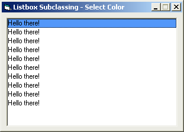

<div align="center">

## Listbox  Select Color


</div>

### Description

What this code does is it subclasses a listbox's parent (in order to trap the listbox's messages), then the listbox (in order to change colors). I have commented the area's that you will need to change in order to change the colors.
 
### More Info
 
I hope this helps you, and don't forget to vote. Thanks ahead of time.

You must end project by click the exit button in the upper right corner of the form or else Visual Basic WILL error.


<span>             |<span>
---                |---
**Submitted On**   |2003-02-10 09:45:12
**By**             |[Charles R\. Chobot](https://github.com/Planet-Source-Code/PSCIndex/blob/master/ByAuthor/charles-r-chobot.md)
**Level**          |Intermediate
**User Rating**    |4.9 (54 globes from 11 users)
**Compatibility**  |VB 6\.0
**Category**       |[Custom Controls/ Forms/  Menus](https://github.com/Planet-Source-Code/PSCIndex/blob/master/ByCategory/custom-controls-forms-menus__1-4.md)
**World**          |[Visual Basic](https://github.com/Planet-Source-Code/PSCIndex/blob/master/ByWorld/visual-basic.md)
**Archive File**   |[Listbox\_\_S1542212102003\.zip](https://github.com/Planet-Source-Code/charles-r-chobot-listbox-select-color__1-43114/archive/master.zip)

### API Declarations

```
'\\ This code is for the people that were wondering
'\\ how to get this working with 2 listbox's instead
'\\ of just one. All the code you will see below is
'\\ what you will need to replace in the original
'\\ form.
'\\ I'm letting you know ahead of time that this code
'\\ could be modified to make it shorter by using
'\\ controll arrays, however I just didn't feel like
'\\ writing the code for arrays. This method still
'\\ works though.
'\\ Enjoy!
Option Explicit
Private Sub Form_Activate()
Dim lrtn As Long
  lrtn = GetWindowLong(lst_subclass1.hwnd, GWL_STYLE)
  If (lrtn And LBS_OWNERDRAWFIXED) = LBS_OWNERDRAWFIXED Then
  End If
  If (lrtn And LBS_MULTIPLESEL) = LBS_MULTIPLESEL Then
    lrtn = lrtn Xor LBS_MULTIPLESEL
  End If
  lrtn = SetWindowLong(lst_subclass1.hwnd, GWL_STYLE, lrtn)
  lrtn = GetWindowLong(lst_subclass2.hwnd, GWL_STYLE)
  If (lrtn And LBS_OWNERDRAWFIXED) = LBS_OWNERDRAWFIXED Then
  End If
  If (lrtn And LBS_MULTIPLESEL) = LBS_MULTIPLESEL Then
    lrtn = lrtn Xor LBS_MULTIPLESEL
  End If
  lrtn = SetWindowLong(lst_subclass2.hwnd, GWL_STYLE, lrtn)
End Sub
Private Sub Form_Load()
Dim i As Integer
  If App.PrevInstance = True Then
    MsgBox "There is an instance already running. Cant run one more"
    Unload Me
  Else
    lst_subclass1.AddItem ("Hello there!")
    lst_subclass2.AddItem ("hello there!")
    mod_subclass.List_Set lst_subclass1
    mod_subclass.List_Set lst_subclass2
    Hook_SetParent Me.hwnd, True
    m_hooked = True
  End If
End Sub
```


